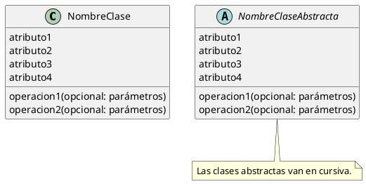
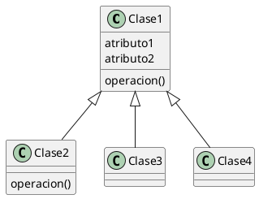
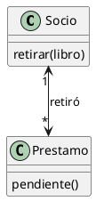
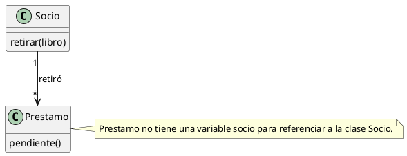
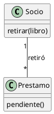
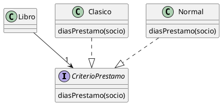
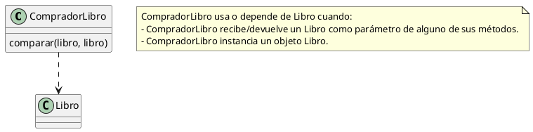

Resumen - Diseño de Sistemas - 2022

- [Introducción al Diseño de Sistemas](#introducción-al-diseño-de-sistemas)
  - [Paradigma de Objetos](#paradigma-de-objetos)
  - [Paradigma estructurado tradicional](#paradigma-estructurado-tradicional)
  - [Paradigma funcional](#paradigma-funcional)
  - [Paradigma lógico](#paradigma-lógico)
  - [Diseño](#diseño)
- [Introducción al Desarrollo de Software](#introducción-al-desarrollo-de-software)
  - [Arquitectura de un sistema software](#arquitectura-de-un-sistema-software)
  - [Motores del diseño](#motores-del-diseño)
  - [Diseño guiado por el dominio](#diseño-guiado-por-el-dominio)
  - [Diseño y desarrollo](#diseño-y-desarrollo)
  - [Metodologías de desarrollo](#metodologías-de-desarrollo)
- [Las entradas del diseño](#las-entradas-del-diseño)
  - [Entradas (inputs)](#entradas-inputs)
    - [Requerimientos](#requerimientos)
    - [Componentes primitivas](#componentes-primitivas)
    - [Restricciones](#restricciones)
    - [Entorno](#entorno)
  - [Atributos de calidad o cualidades del software](#atributos-de-calidad-o-cualidades-del-software)
  - [Requerimientos](#requerimientos-1)
    - [Casos de uso de negocio](#casos-de-uso-de-negocio)
    - [Casos de uso de sistema](#casos-de-uso-de-sistema)
    - [User stories](#user-stories)
    - [Metodología sugerida](#metodología-sugerida)
  - [Visiones del diseño](#visiones-del-diseño)
    - [Diseño Top-Down](#diseño-top-down)
    - [Diseño Bottom-Up](#diseño-bottom-up)
- [Primeras guías para comunicar un diseño](#primeras-guías-para-comunicar-un-diseño)
  - [Diagrama de clase](#diagrama-de-clase)
    - [Tips para documentar clases](#tips-para-documentar-clases)
    - [Relaciones entre clases](#relaciones-entre-clases)
      - [Relación "Hereda" o "De Generalización"](#relación-hereda-o-de-generalización)
      - [Relación "Conoce" o "De Asociación"](#relación-conoce-o-de-asociación)
      - [Relación "Implementa" o "De Realización"](#relación-implementa-o-de-realización)
      - [Relación "Usa" o "De Dependencia"](#relación-usa-o-de-dependencia)
    - [Tips para documentar un diagrama de clases](#tips-para-documentar-un-diagrama-de-clases)
  - [Diagrama de objetos](#diagrama-de-objetos)
  - [Diagrama de secuencia](#diagrama-de-secuencia)
- [Diseño de manejos de errores](#diseño-de-manejos-de-errores)
  - [Tipos de errores](#tipos-de-errores)
    - [Según el momento y forma en que se manifiestan](#según-el-momento-y-forma-en-que-se-manifiestan)
    - [Según su origen](#según-su-origen)
    - [Según su predictibilidad](#según-su-predictibilidad)
    - [Según su lugar de ocurrencia](#según-su-lugar-de-ocurrencia)
  - [Estrategias de manejo de errores](#estrategias-de-manejo-de-errores)
    - [Ocultar el error](#ocultar-el-error)
    - [Tratar el error](#tratar-el-error)
    - [Propagar el error en forma de falla](#propagar-el-error-en-forma-de-falla)
  - [Patrones de manejo de errores](#patrones-de-manejo-de-errores)
    - [Fail Fast](#fail-fast)
    - [Criterio para validaciones](#criterio-para-validaciones)
    - [Mantener consistencia](#mantener-consistencia)
  - [Mecanismos de manejo de errores](#mecanismos-de-manejo-de-errores)
    - [Excepciones](#excepciones)
    - [Call and Return](#call-and-return)
    - [Continuaciones o Callbacks](#continuaciones-o-callbacks)
  - [Anti patrones de manejo de excepciones](#anti-patrones-de-manejo-de-excepciones)
    - [Mezclar mecanismos de manejo de errores](#mezclar-mecanismos-de-manejo-de-errores)
    - [Ocasionar errores intencionalmente](#ocasionar-errores-intencionalmente)
- [Cualidades de Diseño](#cualidades-de-diseño)
  - [Conflictos entre cualidades](#conflictos-entre-cualidades)
  - [Cualidades generales](#cualidades-generales)
    - [Simplicidad](#simplicidad)
    - [Robustez](#robustez)
    - [Flexibilidad](#flexibilidad)
    - [(Des)acoplamiento](#desacoplamiento)
    - [Testeabilidad](#testeabilidad)
    - [Cohesión](#cohesión)
    - [Abstracción](#abstracción)
    - [Consistencia](#consistencia)
    - [Redundancia mínima](#redundancia-mínima)
    - [Mutaciones controladas](#mutaciones-controladas)
  - [Cualidades que dependen de la tecnología](#cualidades-que-dependen-de-la-tecnología)
    - [Seguridad](#seguridad)
    - [Escalabilidad](#escalabilidad)
    - [Eficiencia o Performance](#eficiencia-o-performance)
- [Intro a Manejo de errores con excepciones](#intro-a-manejo-de-errores-con-excepciones)
- [Introducción a Design Patterns](#introducción-a-design-patterns)
  - [Actualidad de la Ingeniería de Software](#actualidad-de-la-ingeniería-de-software)
  - [Utilidad de los Design Patterns](#utilidad-de-los-design-patterns)
  - [Cómo aplicar Design Patterns](#cómo-aplicar-design-patterns)
  - [Cómo NO aplicar Design Patterns](#cómo-no-aplicar-design-patterns)
  - [Cuándo aplicar Design Patterns](#cuándo-aplicar-design-patterns)
- [TIPS PRÁCTICOS](#tips-prácticos)

------------------------------------------------------------------------------------------------------------------------
------------------------------------------------------------------------------------------------------------------------

# Introducción al Diseño de Sistemas

**Diseñar**: tomar decisiones sobre los componentes de un sistema.
**Sistema**: conjunto de partes que se relacionan para lograr un objetivo común.

El diseño de software está englobado en el diseño de sistemas.

## Paradigma de Objetos

Componentes = objetos.
Responsabilidades = interfaz.
Relación entre componentes = envío de mensajes mediante una referencia temporal/permanente.

Interfaz != Implementación
Interfaz: lo que le puedo pedir a un objeto que haga (mensaje).
Implementación: cómo lo resuelve (método).

## Paradigma estructurado tradicional

Componentes = datos, funciones y procedimientos/procesos.
Responsabilidades = interfaz.
Relación entre componentes = estructuras de datos y delegación de responsabilidades.

## Paradigma funcional

Componentes = datos y funciones.
Responsabilidades = funciones.
Relación entre componentes = orden superior y composición.

## Paradigma lógico

Componentes = predicados e individuos.
Responsabilidades = predicado/cláusula.
Relación entre componentes = orden superior y uso de predicados como antecedentes de reglas.

## Diseño

- No hay que considerar a la programación como una tarea menor.
- Diseñar no es diagramar. Diagramar es una manera de documentar lo que ya diseñamos.

------------------------------------------------------------------------------------------------------------------------

# Introducción al Desarrollo de Software

## Arquitectura de un sistema software

**Sistema software**: conjunto de componentes físicos (programas, scripts, computadoras, redes, etc.) y componentes lógicos (objetos, funciones, procedimientos).

**Componentes arquitecturales**:

- Presentación
- Integración/Comunicación
- Dominio
- Persistencia

## Motores del diseño

Hay cuatro enfoques para llevar a cabo un diseño. Son complementarios y se pueden combinar.

**Enfoques**:

- Diseño del modelo de datos (data centric).
- Diseño de la arquitectura de comunicación entre los componentes.
- Diseño las pantallas y la interfaz del usuario.
- Diseño guiado por el dominio.

## Diseño guiado por el dominio

- Se comienza modelando el problema planteado por el usuario.
- Sirve cuando tenemos dominios complejos y cambiantes.
- Permite posponer la toma de decisiones tecnológicas.

## Diseño y desarrollo

El diseño está enmarcado en un proyecto de desarrollo.

## Metodologías de desarrollo

En la mayoría de los casos de trabaja de forma iterativa e incremental. Suele ser la mejor manera de constuir software de manera repetible y segura, sin embargo, puede haber factores externos que impacten nuestro proceso de diseño y desarrollo.

Analizar el problema -> Diseñar -> Construir solución -> Destruir -> Remodelar.

------------------------------------------------------------------------------------------------------------------------

# Las entradas del diseño

**Design**:

*A specification of an object, manifested by an agent, intended to accomplish goals, in a particular environment, using a set of primitive components, satisfying a set of requirements, subject to constraints;*

## Entradas (inputs)

- Requerimientos
- Componentes primitivas
- Restricciones
- Entorno

### Requerimientos

Surgen del proceso de análisis. Se clasifican en:

- Objetivos (subconjunto de requerimientos que resumen el impacto esperado del sistema en el ambiente).
- Funcionales.
- No funcionales.
- Casos de uso (formas en que un usuario puede interactuar con el sistema).

### Componentes primitivas

Son los bloques de construcción provistos por la tecnología subyacente.

### Restricciones

- Tecnológicas
- Leyes/reglamentos
- Negocio
- De arquitectura

### Entorno

Se tienen en cuenta tanto la perspectiva social como la tecnológico:

- Entorno de desarrollo: ambiente donde se diseña/construye/prueba un sistema.
  - Punto de vista social: capacidades del equipo.
  - Punto de vista tecnológico: herramientas, lugar, comunicación, licencias, etc.
- Entorno de uso: ambiente donde se usa el sistema.
  - Punto de vista social: usuario.
  - Punto de vista tecnológico: hardware e infraestructura del usuario.

## Atributos de calidad o cualidades del software

Son características no funcionales que son deseables en un sistema de software:

- Simplicidad
- Correctitud, consistencia, completitud
- Robustez
- Flexibilidad
- Escablabilidad
- Performance
- Seguridad
- Usabilidad
- Facilidad de construcción

Las cualidades del diseño se pueden incorporar como entrada al diseño por un camino distinto del análisis.

## Requerimientos

- Casos de uso (de negocio y de sistema).
- User Stories.

### Casos de uso de negocio

- Los actores son los **interesados en el negocio**, es decir, son **externos a la organización** para la cual desarrollamos el sistema.

### Casos de uso de sistema

- Los actores son los **usuarios** que van a usar nuestro sistema.
- Cada caso de uso de negocio se particiona en uno o más casos de uso de sistema.
- Los casos de uso de sistema dan soporte a los casos de uso de negocio.

### User stories

- Usado en metodologías ágiles.
- Escrita por el cliente en prosa.
- Define una característica del sistema que agrega valor para el cliente.
- No detalla la funcionalidad sino el **objetivo** y la **necesidad**.

### Metodología sugerida

Combinación de:

- Modelo de casos de uso (requisitos funcionales y no funcionales específicos de un caso de uso.)
- Especificación de requerimientos adicionales genéricos, tanto funcionales (reglas de negocio) como no funcionales .
- Modelo de negocio/dominio (contexto del sistema.)
- Esbozos de interfaces de usuario y prototipos para cada actor.

**Modelo de dominio**: conecta los requerimientos (**qué** se debe hacer) con el diseño (**cómo** se debe hacer).

**Domain-Driven Design**: metodología que propone un Modelo de Dominio consensuado entre **usuarios** y **desarrolladores**.

## Visiones del diseño

- Diseño Top-Down.
- Diseño Bottom-Up.

### Diseño Top-Down

- Se tiene una big picture (idea global de lo que hace un sistema).
- Se divide el sistema en partes o componentes.
- Cada componente es una caja negra.
- A mayor nivel de detalle, menor nivel de complejidad.
- Estrategias de prueba.

### Diseño Bottom-Up

- Componentes de bajo nivel.
- Especificaciones muy detalladas.
- Integración de componentes para formar subsistemas.
- Integración de subsistemas para formar el sistema final.
- A mayor avance del desarrollo, mayor complejidad y completitud de componentes.

------------------------------------------------------------------------------------------------------------------------

# Primeras guías para comunicar un diseño

Al diseñar se usa:

- Código.
- UML (Unified Modeling Language).
- Diagramas estáticos y dinámicos.

## Diagrama de clase

**Clase**: representada por un rectángulo con tres secciones:



### Tips para documentar clases

- Poner buenos nombres a las abstracciones.
- No se recomienda documentar las variables.
- Documentar solo los mensajes más relevantes.
- Una clase sin comportamiento no comunica qué rol cumple en la solución.
- Si no sabemos los parámetros que vamos a necesitar, definir el nombre solamente.

### Relaciones entre clases

#### Relación "Hereda" o "De Generalización"



Una clase hereda los atributos, relaciones, operaciones y métodos de otra clase más general. Esto no sucede con objetos, solo con clases.

Cuando una subclase redefine (override) el comportamiento de su superclase, se deben escribir los nombres de los métodos que redefine. En este caso, ``Clase2`` redefine ``operacion()``.

#### Relación "Conoce" o "De Asociación"

Uno de los elementos conoce al otro, para lo cual guarda una referencia como variable de instancia.

Puede que ambos elementos se conozcan entre sí:



Puede que un elemento no conozca al otro:



En caso de duda se pueden omitir las flechas de navegación.



0, 1 o * indica la **multiplicidad**: cuántos objetos de una clase se relacionan con la otra. En este caso cada socio tiene varios prestamos y cada prestamo tiene asociado un solo socio.

#### Relación "Implementa" o "De Realización"

Se establece entre una clase y una interfaz. La clase debe implementar todas las operaciones definidas en la interfaz.



#### Relación "Usa" o "De Dependencia"

Uno de los elementos **usa** o **depende** del otro.



Esta relación se puede dar:

- De una clase hacia otra.
- De una clase hacia una interfaz.

### Tips para documentar un diagrama de clases

- Cuando hay una relación de **asociación** y de **dependencia** entre dos clases se grafica solo la más fuerte (la de **asociación**).
- Cuando hay relaciones de **asociación** y de **generalización** entre dos clases se grafican ambas.
- En las relaciones de asociación o dependencia, las flechas apuntan hacia la superclase o interfaz.
- No pueden haber clases que no estén relacionadas con otras.
- Una flecha de asociación está marcando una referencia de un objeto a otro, es redundante escribir el atributo.

## Diagrama de objetos

No resumido

## Diagrama de secuencia

No resumido

------------------------------------------------------------------------------------------------------------------------

# Diseño de manejos de errores

**Error**: se produce cuando hay una condición que no se cumplió al realizar una operación.

## Tipos de errores

### Según el momento y forma en que se manifiestan

- **De tiempo de compilación**: no permiten que el sistema se construya y evitan que se ejecute.
- **De tiempo de ejecución (falla)**: no permiten que el sistema continúe ejecutándose. Ante la aparición de un error de este tipo, el programa aborta su ejecución normal.
- **De lógica**: son los más peligrosos porque permiten que el sistema se construya y se ejecute, pero con un comportamiento que no es el esperado.

### Según su origen

- **Error de programa/sistema**: errores genéricos que son propios de la tecnología que estemos utilizando para construir nuestro sistema.
- **Error de aplicación/dominio**: errores específicos de nuestro dominio, que se derivan de nuestras reglas de negocio.

### Según su predictibilidad

- **Predecibles**: errores que se podrían haber evitado por algún componente. Están asociados con una mala programación.
- **No predecibles**: errores que no se pueden anticipar desde mi código ya que ningún componente es responsable de verificar la precondición.

### Según su lugar de ocurrencia

- **Internos al sistema**: ocurren dentro de mi sistema por errores que se originaron en su propio código.
- **Externos al sistema**: ocurren porque un sistema externo se comunicó de una manera inválida con mi sistema

## Estrategias de manejo de errores

- Ocultar el error
- Tratar el error
- Propagar el error en forma de falla

### Ocultar el error

NO SE DEBE HACER.

### Tratar el error

Intentar recuperarse del error tiene 2 problemas:

- El componente que percibe la falla no tiene suficiente información como para saber qué hacer.
- Nos puede llevar a tener estados inconsistentes.

### Propagar el error en forma de falla

Si un componente B detecta un error en un componente C, y (como normalmente ocurrirá) no es nuestra responsabildiad tratarlo, entonces lo que debemos hacer es propagar el error, en forma de falla: notificar el error al componente A que llamó a B.

- Si estamos ante un error de lógica, debemos convertirlo en falla tan pronto como sea posible, para evitar continuar trabajando sobre un estado erróneo.
- Si el error se manifestó ya como una falla, debemos simplemente abrirle paso a esta falla y permitir que escale.

## Patrones de manejo de errores

### Fail Fast

Ante la detección de un error de lógica se debe hacer fallar al sistema lo antes posible.

**Propagar la FALLA , no el ERROR.**

### Criterio para validaciones

- Validar  toda la información que llega al sistema (particularmente si proviene de usuarios).
- Confiar en la información que la aplicación maneja internamente.

### Mantener consistencia

Si estamos ante un error, y vamos a fallar o propagar una falla, debemos hacerlo antes de que el estado del componente quede inconsistente.

## Mecanismos de manejo de errores

- Excepciones
- Call and Return
- Continuaciones

### Excepciones

Mecanismo más popular, simple y robusto:

- Popular: todos los lenguajes de objetos la soportan.
- Simple: se implementa con pocas primitivas.
- Robusto: genera stacktraces que ayudan a rastrear el error.

### Call and Return

**Códigos de error**: mecanismo más endeble. Se presta a confusiones y no permite la propagación de una falla que aborte el flujo de ejecución.
**Cosificar el error**: Si se aprovecha el sistema de tipos y orden superior, es posible propagar en forma de falla.

Java con Optional:

Implementación simple:

```java
clase Comprador
  metodo comprar()
    variable producto = elegirProducto()
    cuando pagador.realizarPago(producto)
      caso Exito(identificador) -> 
        guardarIdentificador(identificador, producto)
          retornar nuevo Exito()
      caso fracaso ->
          retornar fracaso

clase Pagador 
  metodo realizarPago(producto) 
    si seCumplenCondicionesDePago(producto)
      variable identificador = hacerPagoPosta(producto)
      retornar nuevo Exito(identificador)
    si no
      retornar nuevo Fracaso(nuevo Error("no se cumplen las condiciones"))
```

- No puedo acceder directamente al resultado, lo que me obliga a ser consciente de la posibilidad de error y al menos impide que lo ignore.
- Los errores son objetos ahora, puedo enviarles mensajes, lo cual me da nuevas posibilidades.

Implementación mejorada:

``` java
clase Comprador
  metodo comprar()
    variable producto = elegirProducto()
    retornar pagador
      .realizarPago(producto)
      .siTieneExito(identificador -> guardarIdentificador(identificador, producto))
```

- La propagación pasa a ser implícita.

### Continuaciones o Callbacks

Se usa en JavaScript, pero no en Java, C# o Python. No es importante, no lo resumo.

## Anti patrones de manejo de excepciones

### Mezclar mecanismos de manejo de errores

**Evitar mezclar distintos mecanismos de manejo de error, o al menos, hacerlo con particular cuidado.**

Ejemplo: retornar true en caso exitoso y lanzar excepciones en caso de error:

```java
metodo inscribir(jugador)
  si puedoInscribirNuevo() entonces
    jugadores.agregar(jugador)
    retornar true
  si no
    lanzar EspacioInsuficienteException()
```

Si el método nunca va a devolver ``false``, entonces ¿para qué retornar un valor con una única posibilidad? Mejor sería que el método no retorne valor y lance excepción en caso de error:

```java
metodo inscribir(jugador)
  si puedoInscribirNuevo() entonces
    jugadores.agregar(jugador)
  si no
    lanzar EspacioInsuficienteException()
```

O mejor:

```java
metodo inscribir(jugador)
  si no puedoInscribirNuevo() entonces
    lanzar EspacioInsuficienteException()
  jugadores.agregar(jugador)
```

### Ocasionar errores intencionalmente

Si el error es predecible (porque conocemos sus causas) muchas veces podemos evitarlo en lugar de manejarlo.

Mal:

```java
 void reportarCantidadLotesEstimados() {
   try {
     this.reportarCantidadLotes(
         this.cargaTotal / this.tamanioLoteDisponible);
   } catch (ArithmeticException e) {
     this.reportarFaltaDeEspacio();
   }
 }
```

Bien:

```java
 void reportarCantidadLotesEstimados() {
   if (this.tamanioLoteDisponible > 0) {
     this.reportarCantidadLotes(
        this.cargaTotal / this.tamanioLoteDisponible);
   } else {
     this.reportarFaltaDeEspacio();
   }
 }

```

------------------------------------------------------------------------------------------------------------------------

# Cualidades de Diseño

Son heurísticas (métodos para aumentar el conocimiento), no reglas.

Sirven para comparar diseños y tomar decisiones sobre ellos.

Siempre debemos tener en cuenta:

- Un **diseño alternativo** (una pieza de software no es simple, sino más simple que otra).
- Un **contexto** (una diseño de un componente no es más flexible que otro, sino más flexible en cierto contexto).

## Conflictos entre cualidades

Algunas cualidades tienen correlación positiva:

- cohesión y abstracción.
- desacoplamiento y testeabilidad.

Otras entran en conflicto:

- flexibilidad y robustez (abrir vs. cerrar caminos, los deseos del usuario vs. el momento de implementar).
- simplicidad vs. extensibilidad.

Es el *síndrome de la frazada corta*: debemos preponderar una cualidad sobre la otra con criterios técnicos y de negocio.

## Cualidades generales

Se pueden analizar a un nivel superficial o intermedio de la tecnología en la cual se implementaron.

### Simplicidad

**KISS** (Keep It Simple Stupid):
No tener abstracciones no fundamentales, innecesarias, que no aporten al negocio.

**YAGNI** (You Aren't Gonna Need It):
No agergar funcionalidad que no apunte a la problemática actual, focalizarse en las necesidades conocidas.

**Beneficios**:

- Ahorro de **tiempo**, **energía** y **dinero**.
- No agregar **complejidad** al proyecto.

**Complejidad**:

- Complejidad esencial: propia del problema, se debe manejar de la forma más simple posible.
- Complejidad accidental: propia de nuestro diseño, se debe evitar.

### Robustez

Capacidad del sistema de lidiar con fallas internas o usos inadecuados del sistema.

- No generar información o comportamiento inconsistente/errático.
- Reportar los errores y volver a un estado consistente (Fail Fast).
- Facilitar la detección de la causa del problema.

### Flexibilidad

Capacidad de reflejar cambios en el dominio de manera simple y sencilla.

- **Extensibilidad**: capacidad de agregar nuevas características con poco impacto.
- **Mantenibilidad**: capacidad de modificar las características existentes con el menor esfuerzo posible.

### (Des)acoplamiento

El acoplamiento es el grado de **dependencia entre dos módulos/componentes**, es decir, es el nivel de conocimiento que un módulo tiene sobre otro.

A **menor** acoplamiento:

- **Mayor** mantenibilidad.
- **Mayor** reutilización.
- **Menor** propagación de errores.

### Testeabilidad

Permite asegurar que el código funciona correctamente y es mantenible.

Se ve más adelante:

- Pruebas Unitarias
- TDD

### Cohesión

Grado de relación entre las responsabilidades de un componente.

A mayor cantidad de responsabilidades, menor cohesión.

### Abstracción

**Calidad**:
Si nuestras abstracciones tienen buena **calidad**, brindarán más **reusabilidad** y **genericidad** a nuestro código.

**Cantidad**:
Se debe identificar cuales son **abstracciones fundamentales** para el diseño de la solución, y cuales son **prescindibles** (complejidades accidentales).
*“Make things as simple as possible, but not simpler"*

### Consistencia

Un diseño es consistente cuando ante problemas de diseño similares, se tomaron decisiones de diseño similares.

### Redundancia mínima

Cuando el mismo conocimiento está presente en múltiples lugares.

- **Repetición de lógica**: menor flexibilidad, más riesgo de cometer y rastrear errores. Principio de **DRY** (Don’t repeat yourself).
- **Repetición de información**: inconsistencias en los datos. Tener en cuenta el proceso de **normalización**. El conocimiento debe estar en un sólo lugar.

### Mutaciones controladas

Cuanto menos cambio de estado presentan mis componentes mientras el sistema se encuentra en funcionamiento, más fácil resulta razonar sobre el mismo.

- **Favorecer la inmutabilidad**: diseñar los componentes para que no cambien internamente.
- **Minimizar la mutabilidad**: realizar las mutaciones sólo cuando realmente es necesario.

## Cualidades que dependen de la tecnología

Se pueden analizar a un nivel profundo de la tecnología y la arquitectura en la cual se implementaron.

### Seguridad

La capacidad del sistema de impedir que agentes externos realicen acciones sobre él.

### Escalabilidad

Facilidad con la que un sistema inicialmente pensado para una determinada carga puede ser adaptado para soportar una carga mayor.

### Eficiencia o Performance

Cuán buen uso hace el sistema de los recursos disponibles.

Tres niveles:

- Recursos Humanos necesarios para la construcción del sistema (horas persona).
- Recursos Humanos para la ejecución del sistema (tiempo usuario).
- Recursos Hardware necesarios para la ejecución del sistema (memoria, procesador, almacenamiento).

Hoy en día el hardware es más barato, con lo cual se presta más atención a la escalabilidad.

------------------------------------------------------------------------------------------------------------------------

# Intro a Manejo de errores con excepciones

**Excepción**: evento que altera el flujo normal de mensajes entre objetos.


------------------------------------------------------------------------------------------------------------------------

# Introducción a Design Patterns

**Design Pattern**:

- *“Es una regla que expresa la relación entre un contexto, un problema y una solución”*. - Christopher Alexander
- *“Es una solución (probada) a un problema en un determinado contexto”* - Erich Gamma
- *“Un Patrón de Diseño nombra, abstrae e identifica los aspectos clave de una estructura común de diseño que lo hace útil para crear un diseño orientado a objetos reutilizable.”* - Erich Gamma

Componentes de un pattern:

- **nombre**: describe el problema.
- **problema**: define cuando aplicar el pattern.
- **solución**: contiene una plantilla genérica de los elementos que componen el diseño, sus responsabilidades, relaciones y colaboraciones.
- **consecuencias**: analiza el impacto de aplicar un pattern en una solución.

Un Design Pattern:

- NO garantiza un sistema bien diseñado.
- NO es una solución. Es una herramienta para pensar una solución.
- NO son implementables, necesitan aplicarse a un dominios para ser algo concreto.

## Actualidad de la Ingeniería de Software

La visión de la cadena de montaje (desarrollo en cascada) **no aplica** a la producción de software.

El trabajo del ingeniero consiste en **formalizar la toma de decisiones** y **generar herramientas** a partir de ello.

- Proceso = **Pattern**
- Metodología = **Best Practices**

**Best Practice**: es una práctica formalizada a partir de un descubrimiento en la cual se describe su utilidad, características y debilidades para poder ser reutilizada.
**Design Pattern**: es la intención de formalizar una práctica de diseño, una herramienta para diseñar.

## Utilidad de los Design Patterns

- Permite explorar el diseño de manera más abarcativa.
- Genera un vocabulario más específico dentro de la comunidad.
- Nos incita a pensar de manera más genéricas para problemas futuros.
- Es una forma de documentación.

## Cómo aplicar Design Patterns

- 23 patterns originales del libro del Gang of Four.
- Catálogo de patterns: <http://hillside.net/patterns/patterns-catalog>.

Cada Pattern tiene tres secciones que describen el problema que resuelve:

- **Intent**
- **Motivation**
- **Applicability**

Tipos de patterns:

- **Creacionales**: abstraen el proceso de instanciación y configuración de los objetos.
- **Estructurales**: se encargan de definir estructuras de objetos, se estudian con los diagramas de clases/objetos + código.
- **De comportamiento**: se encargan de la asignación de responsabilidades entre objetos y cómo se comunican entre sí, se estudian con diagramas de secuencia/colaboración + código.

Recomendación de Gamma: *concentrarse en encapsular la parte más variable de nuestra aplicación*.

Para elegir los nombres de las clases, en algunos casos es conveniente usar como sufijo el nombre del rol que cumple dentro del pattern.
*Ej.: Si una clase va a ser la encargada de notificar un cambio en un depósito -> ``DepositoObserver``.*

## Cómo NO aplicar Design Patterns

Los Design Patterns no deben ser usados indiscriminadamente. Si bien logramos mayor flexibilidad, también agregamos complejidad.

*LEER PÁGS 24 Y 25 DEL LIBRO DE GAMMA: 8 causas comunes de rediseño.*

## Cuándo aplicar Design Patterns

Para que un sistema evolucione, debe:

- Aceptar los requerimientos de los usuarios.
- Volverse flexible para poder aceptar nuevos requerimientos (**refactorización**).

En cada refactor se hace al diseño un poco más general y se decide si aplicar o descartar patterns.

------------------------------------------------------------------------------------------------------------------------
------------------------------------------------------------------------------------------------------------------------

# TIPS PRÁCTICOS

- favorezcamos siempre los constructores por sobre los setters.
- no debería haber clases con el nombre del sistema.
- definir varios métodos con el mismo nombre se denomina **sobrecarga**.
